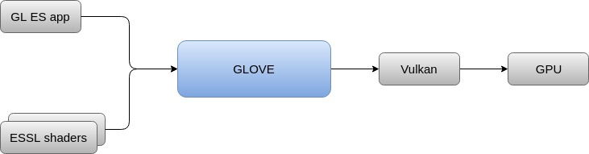

# GLOVE - GL Over Vulkan



GLOVE (GL Over Vulkan) is a software library that acts as an intermediate layer between an OpenGL application and Vulkan.

GLOVE is focused towards embedded systems and is comprised of OpenGL ES and EGL implementations, which translate at runtime all OpenGL ES / EGL calls & ESSL shaders to Vulkan commands &amp; SPIR-V shader respectively and finally relays them to the underlying Vulkan driver.

GLOVE has been designed towards facilitating developers to easily build and integrate new features, allowing at the same time its further extension, portability and interoperability. Currently, GLOVE supports [OpenGL ES 2.0](https://www.khronos.org/registry/OpenGL/specs/es/2.0/es_full_spec_2.0.pdf) and [EGL 1.4](https://www.khronos.org/registry/EGL/specs/eglspec.1.4.pdf) on a Linux platform, but the modular design can be easily extended to encompass implementations of other client APIs as well.

GLOVE is considered as a work-in-progress and is open-sourced under the LGPL v3 license through which it is provided as free software with unlimited use for educational and research purposes.

Future planned extensions of GLOVE include the support for OpenGL ES 3.x and OpenCL applications.


# Prerequisites

As a prerequisite for correct functioning, GLOVE must be linked to a Vulkan driver implementation which supports **VK_KHR_maintenance1** extension, mandatory for OpenGL to Vulkan Coordinates conversion (left handed to right handed coordinate system).
Also, the minimum Vulkan loader version must be 1.0.24.

# Tested with the following configurations

GLOVE has been tested with [GLOVE demos](Demos/README_demos.md) with the following configurations

| **GL version** | **Vulkan Driver** | **Vulkan API version** | **OS** | **Windows Platform** | **Graphics Card** | **status** | **notes** |
| --- | --- | --- | --- | --- | --- | --- | --- |
| Open GL ES 2.0 |MESA Vulkan Intel driver (version 0x4402008) | 1.0.54 | Ubuntu 16.04 | XCB | Intel Ivybridge Desktop | success | - |
| Open GL ES 2.0 |MESA Vulkan Intel driver (version 0x4800001)| 1.0.57 | Ubuntu 16.04 | XCB | Intel HD Graphics 530 (Skylake GT2) | success | applied depth buffer workaround | 
| Open GL ES 2.0 |NVIDIA Vulkan driver (version 384.130)| 1.0.49 | Ubuntu 16.04 | XCB |NVIDIA GeForce 940M | ongoing | - |

# SW Desing

You can find a short description on GLOVE SW design as well as "How To extend GLOVE" guidelines in [GLOVE Design Document](Docs/GLOVEDesignDocument.md)

# Installation Instructions

## Download the Repository

To create your local git repository:

```
git clone https://github.com/Think-Silicon/GLOVE.git
```

## Required Packages

To install all required packages:

```
sudo apt-get install git cmake extra-cmake-modules libvulkan-dev vulkan-utils build-essential libx11-xcb-dev
```

Optionally "mesa-vulkan-drivers" package is needed if no other Vulkan driver is available.
The compiler minimum version that this project is built with, is GCC 4.9.3, although earlier versions may work.

## External Repositories Dependencies

Khronos [glslang](https://github.com/KhronosGroup/glslang) repository is mandatory for compiling, validating and generating SPIR-V from ESSL shaders.

Google [googletest](https://github.com/google/googletest) repository is used for unit testing.

To get and build the above projects:

```
./update_external_sources.sh
```

## Configure Building

GLOVE building can be configured according to the options listed in the following table:

```
./configure.sh [-options]
```

| **Option** | **Default** | **Description** |
| --- | --- | --- |
| -a \| --arm-compile | _OFF_ | _Enable cross building for ARM platform_ |
| -d \| --debug | _OFF_ | _Enable building Debug mode_ |
| -i \| --install-path (dir) | _System Installation Path (/usr/local)_ | _Set custom installation path_ |
| -s \| --sysroot (dir) | _-_ | _Set sysroot for cross compilation_ |
| -t \| --trace-build | _OFF_ | _Enable logs_ |
| -u \| --vulkan-include-path (dir) | _System Include Path_ | _Set custom Vulkan include path_ |
| -v \| --vulkan-loader (lib) | _System Vulkan Loader_ | _Set custom Vulkan loader library_ |
| -w \| --no-workarounds | _OFF_ | _Disable workarounds_ |


## Build Project

To build the Project:

```
make
```

## Install Project

To install all necessary files to system directories:

```
sudo make install
```

## Uninstall

To uninstall the libraries from the system directories:

```
sudo make uninstall
```

# Known Issues

GLOVE is considered as work-in-progress, therefore there are known issues that have to be resolved or improved. 

You can see a detailed list of issues in [Known Issues List](Docs/KnownIssues.md)

# Demos

GLOVE is accompanied by a demo SDK that contains fully commented, highly optimized C applications (accompanied by the ESSL shader source code). These demos demonstrate some simple rendering techniques with different geometry complexities, as they were designed with the restrictions of low-power embedded platforms in mind.

See details in [Demos README](Demos/README_demos.md)

# Benchmarking

GLOVE is aiming to take advantage of Vulkan in terms of performance. First results are very promising and major performance upgrades are in progress too. Instructions to use some available benchmarks for testing can be found in [Benchmarking README](Benchmarking/README_benchmarking.md)
